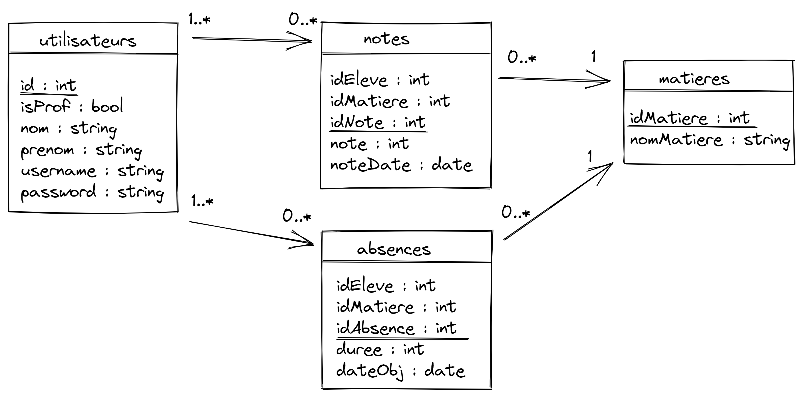

### Relations :
- 1..* éleve(s) a 1..* cours
- 1 prof a 1 cours

### DB ECOLE :
- Table ELEVE
- Table PROF
- TABLE COURS

### formalisme :
- Un élève peut avoir plusieurs cours
- un cours ne peut avoir qu'un enseignant
- un enseignant ne peut avoir qu'un cours

## fctnement global : 
la db sert à compter le nb d'heure de cours pour chaque élève/prof par semaine.
